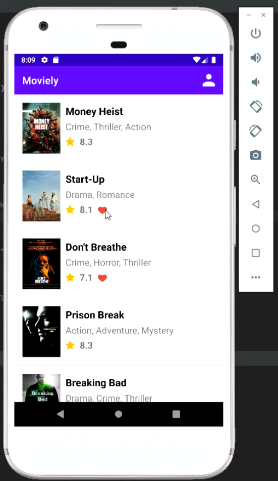
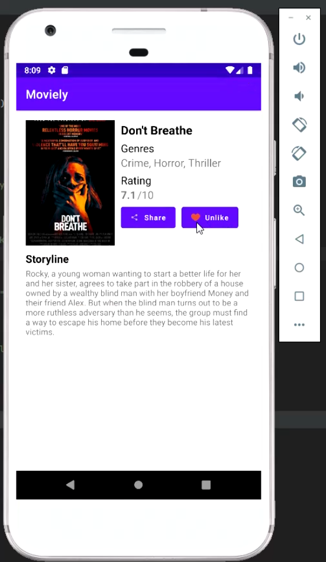

# moviely
A simple movie recommendation app built with Kotlin (static)  
This application is made for an assignment in my college.

# Screenshots
 

# Full Demo
https://www.youtube.com/watch?v=oe03Wd9w78Y
